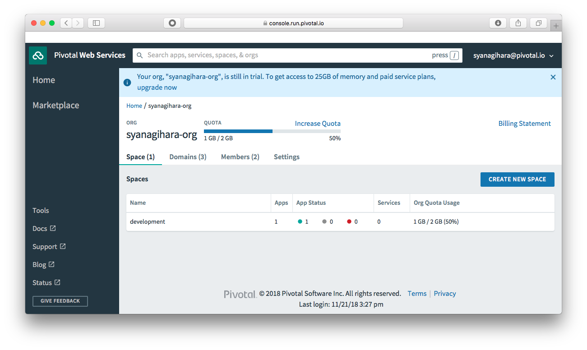

# Java アプリケーションのデプロイ
簡単な Java アプリケーションを Pivotal Cloud Foundry へデプロイします。

## 概要 / 説明
ここでは、簡単な Java のアプリケーションを作成し、デプロイを **cf push** コマンドで行ってみます。
そして実際にデプロイされたアプリケーションを **Pivotal Cloud Foundry Apps Manager** (アプリケーションの管理ダッシュボード) から確認してみます。

Java のアプリケーションは、[Spring Boot](http://projects.spring.io/spring-boot/)を使い、とてもシンプルなWebアプリケーションを作成します。
作ったアプリケーションを cf コマンドを使って PCF へデプロイを行います。
また、デプロイする時に使用される Buildpack についても見てみます。

## 前提 / 環境
- [事前作業](https://github.com/shinyay/pcf-workshop-prerequisite/blob/master/README.md) 実施済み

## 手順 / 解説
### プロジェクトの作成
GitHub 上に作成済みの Spring Boot プロジェクトをクローン(`git clone`)しプロジェクトを作成します。

- https://github.com/shinyay/pcf-workshop-deploy-java-code.git

任意のディレクトリで、以下のコマンドを実行します。

```
$ mkdir pcf-workshop
$ cd pcf-workshop
$ git clone https://github.com/shinyay/pcf-workshop-deploy-java-code.git hello-pcf
$ cd hello-pcf
```

### アプリケーションの修正
クローンしたプロジェクトに含まれている次のソースコードを編集します。

- src/main/java/com/example/hellopcf/HelloPcfApplication.java

#### 編集内容
- GET アクセスでの "Hello, World!" の表示
  - `RestController` アノテーションの追加
  - `GetMapping` アノテーションを持つ処理の追加

<details><summary>編集済みソースコード</summary>

```java
package com.example.hellopcf;

import org.springframework.boot.SpringApplication;
import org.springframework.boot.autoconfigure.SpringBootApplication;
import org.springframework.web.bind.annotation.GetMapping;
import org.springframework.web.bind.annotation.RestController;

@SpringBootApplication
@RestController
public class HelloPcfApplication {

    @GetMapping("/")
    String hello() {
        return "Hello, World!";
    }

	public static void main(String[] args) {
		SpringApplication.run(HelloPcfApplication.class, args);
	}
}
```

</details>

### アプリケーションのビルド
以下のコマンドでアプリケーションをビルドします。
```
$ ./gradlew build -x test
```

### アプリケーションのローカル実行
以下のコマンドでビルドした Spring Boot アプリケーション を実行します。

```
$ java -jar build/libs/hello-pcf-0.0.1-SNAPSHOT.jar
```

<details><summary>実行結果</summary>

```
  .   ____          _            __ _ _
 /\\ / ___'_ __ _ _(_)_ __  __ _ \ \ \ \
( ( )\___ | '_ | '_| | '_ \/ _` | \ \ \ \
 \\/  ___)| |_)| | | | | || (_| |  ) ) ) )
  '  |____| .__|_| |_|_| |_\__, | / / / /
 =========|_|==============|___/=/_/_/_/
 :: Spring Boot ::        (v2.1.0.RELEASE)

2018-11-21 14:26:56.348  INFO 2598 --- [           main] c.example.hellopcf.HelloPcfApplication   : Starting HelloPcfApplication on syanagihara.local with PID 2598 (/Users/shinyay/workspace/workshop/pcf-workshop-deploy-java/build/libs/hello-pcf-0.0.1-SNAPSHOT.jar started by shinyay in /Users/shinyay/workspace/workshop/pcf-workshop-deploy-java)
2018-11-21 14:26:56.352  INFO 2598 --- [           main] c.example.hellopcf.HelloPcfApplication   : No active profile set, falling back to default profiles: default
2018-11-21 14:26:57.610  INFO 2598 --- [           main] o.s.b.w.embedded.tomcat.TomcatWebServer  : Tomcat initialized with port(s): 8080 (http)
2018-11-21 14:26:57.632  INFO 2598 --- [           main] o.apache.catalina.core.StandardService   : Starting service [Tomcat]
2018-11-21 14:26:57.632  INFO 2598 --- [           main] org.apache.catalina.core.StandardEngine  : Starting Servlet Engine: Apache Tomcat/9.0.12
2018-11-21 14:26:57.643  INFO 2598 --- [           main] o.a.catalina.core.AprLifecycleListener   : The APR based Apache Tomcat Native library which allows optimal performance in production environments was not found on the java.library.path: [/Users/shinyay/Library/Java/Extensions:/Library/Java/Extensions:/Network/Library/Java/Extensions:/System/Library/Java/Extensions:/usr/lib/java:.]
2018-11-21 14:26:57.722  INFO 2598 --- [           main] o.a.c.c.C.[Tomcat].[localhost].[/]       : Initializing Spring embedded WebApplicationContext
2018-11-21 14:26:57.722  INFO 2598 --- [           main] o.s.web.context.ContextLoader            : Root WebApplicationContext: initialization completed in 1323 ms
2018-11-21 14:26:57.970  INFO 2598 --- [           main] o.s.b.w.servlet.FilterRegistrationBean   : Mapping filter: 'characterEncodingFilter' to: [/*]
2018-11-21 14:26:57.970  INFO 2598 --- [           main] o.s.b.w.servlet.FilterRegistrationBean   : Mapping filter: 'webMvcMetricsFilter' to: [/*]
2018-11-21 14:26:57.971  INFO 2598 --- [           main] o.s.b.w.servlet.FilterRegistrationBean   : Mapping filter: 'hiddenHttpMethodFilter' to: [/*]
2018-11-21 14:26:57.971  INFO 2598 --- [           main] o.s.b.w.servlet.FilterRegistrationBean   : Mapping filter: 'formContentFilter' to: [/*]
2018-11-21 14:26:57.971  INFO 2598 --- [           main] o.s.b.w.servlet.FilterRegistrationBean   : Mapping filter: 'requestContextFilter' to: [/*]
2018-11-21 14:26:57.971  INFO 2598 --- [           main] o.s.b.w.servlet.FilterRegistrationBean   : Mapping filter: 'httpTraceFilter' to: [/*]
2018-11-21 14:26:57.971  INFO 2598 --- [           main] o.s.b.w.servlet.ServletRegistrationBean  : Servlet dispatcherServlet mapped to [/]
2018-11-21 14:26:58.223  INFO 2598 --- [           main] o.s.s.concurrent.ThreadPoolTaskExecutor  : Initializing ExecutorService 'applicationTaskExecutor'
2018-11-21 14:26:58.483  INFO 2598 --- [           main] o.s.b.a.e.web.EndpointLinksResolver      : Exposing 2 endpoint(s) beneath base path '/actuator'
2018-11-21 14:26:58.568  INFO 2598 --- [           main] o.s.b.w.embedded.tomcat.TomcatWebServer  : Tomcat started on port(s): 8080 (http) with context path ''
2018-11-21 14:26:58.572  INFO 2598 --- [           main] c.example.hellopcf.HelloPcfApplication   : Started HelloPcfApplication in 2.527 seconds (JVM running for 2.945)
```
</details>

実行したら、[http://localhost:8080](http://localhost:8080) にアクセスします。
"Hello, World!" の表示が確認できます。


### アプリケーションを Pivotal Cloud Foundry にデプロイ (push)
以下のコマンドでビルドした Spring Boot アプリケーション を Pivotal Cloud Foundry にデプロイします。

```
$ cf push hello-pcf -p build/libs/hello-pcf-0.0.1-SNAPSHOT.jar --random-route
```

<details><summary>実行結果</summary>

```
syanagihara@pivotal.io としてアプリ hello-pcf を組織 syanagihara-org / スペース development にプッシュしています...
アプリ情報を取得しています...
これらの属性でアプリを作成しています...
+ 名前:       hello-pcf
  パス:       /Users/shinyay/workspace/workshop/pcf-workshop-deploy-java/build/libs/hello-pcf-0.0.1-SNAPSHOT.jar
  経路:
+   hello-pcf-wise-bonobo.cfapps.io

アプリ hello-pcf を作成しています...
経路をマップしています...
ローカル・ファイルをリモート・キャッシュと比較しています...
Packaging files to upload...
ファイルをアップロードしています...
 251.61 KiB / 251.61 KiB [==========================================================================================================================================================================================================================================] 100.00% 1s

API がファイルの処理を完了するのを待機しています...

アプリをステージングし、ログをトレースしています...
   Downloading dotnet_core_buildpack_beta...
   Downloading dotnet_core_buildpack...
   Downloading java_buildpack...
   Downloading python_buildpack...
   Downloading ruby_buildpack...
   Downloaded python_buildpack
   Downloading nodejs_buildpack...
   Downloaded dotnet_core_buildpack_beta
   Downloading go_buildpack...
   Downloaded dotnet_core_buildpack
   Downloaded ruby_buildpack
   Downloading php_buildpack...
   Downloaded go_buildpack
   Downloading binary_buildpack...
   Downloading staticfile_buildpack...
   Downloaded java_buildpack
   Downloaded staticfile_buildpack
   Downloaded nodejs_buildpack
   Downloaded php_buildpack
   Downloaded binary_buildpack
   Cell dc24c27d-e16a-426a-aba2-39117d63ca91 creating container for instance e4ae3235-c17b-49d2-8242-166c10fd538d
   Cell dc24c27d-e16a-426a-aba2-39117d63ca91 successfully created container for instance e4ae3235-c17b-49d2-8242-166c10fd538d
   Downloading app package...
   Downloaded app package (15.3M)
   -----> Java Buildpack v4.16.1 (offline) | https://github.com/cloudfoundry/java-buildpack.git#41b8ff8
   -----> Downloading Jvmkill Agent 1.16.0_RELEASE from https://java-buildpack.cloudfoundry.org/jvmkill/trusty/x86_64/jvmkill-1.16.0_RELEASE.so (found in cache)
   -----> Downloading Open Jdk JRE 1.8.0_192 from https://java-buildpack.cloudfoundry.org/openjdk/trusty/x86_64/openjdk-1.8.0_192.tar.gz (found in cache)
          Expanding Open Jdk JRE to .java-buildpack/open_jdk_jre (1.0s)
          JVM DNS caching disabled in lieu of BOSH DNS caching
   -----> Downloading Open JDK Like Memory Calculator 3.13.0_RELEASE from https://java-buildpack.cloudfoundry.org/memory-calculator/trusty/x86_64/memory-calculator-3.13.0_RELEASE.tar.gz (found in cache)
          Loaded Classes: 13694, Threads: 250
   -----> Downloading Client Certificate Mapper 1.8.0_RELEASE from https://java-buildpack.cloudfoundry.org/client-certificate-mapper/client-certificate-mapper-1.8.0_RELEASE.jar (found in cache)
   -----> Downloading Container Security Provider 1.16.0_RELEASE from https://java-buildpack.cloudfoundry.org/container-security-provider/container-security-provider-1.16.0_RELEASE.jar (found in cache)
   -----> Downloading Spring Auto Reconfiguration 2.5.0_RELEASE from https://java-buildpack.cloudfoundry.org/auto-reconfiguration/auto-reconfiguration-2.5.0_RELEASE.jar (found in cache)
   Exit status 0
   Uploading droplet, build artifacts cache...
   Uploading droplet...
   Uploading build artifacts cache...
   Uploaded build artifacts cache (131B)
   Uploaded droplet (62.1M)
   Uploading complete
   Cell dc24c27d-e16a-426a-aba2-39117d63ca91 stopping instance e4ae3235-c17b-49d2-8242-166c10fd538d
   Cell dc24c27d-e16a-426a-aba2-39117d63ca91 destroying container for instance e4ae3235-c17b-49d2-8242-166c10fd538d

アプリが開始するのを待機しています...

名前:                   hello-pcf
要求された状態:         started
経路:                   hello-pcf-wise-bonobo.cfapps.io
最終アップロード日時:   Wed 21 Nov 15:28:25 JST 2018
スタック:               cflinuxfs2
ビルドパック:           client-certificate-mapper=1.8.0_RELEASE container-security-provider=1.16.0_RELEASE java-buildpack=v4.16.1-offline-https://github.com/cloudfoundry/java-buildpack.git#41b8ff8 java-main java-opts java-security jvmkill-agent=1.16.0_RELEASE
                        open-jd...

タイプ:           web
インスタンス:     1/1
メモリー使用量:   1024M
開始コマンド:     JAVA_OPTS="-agentpath:$PWD/.java-buildpack/open_jdk_jre/bin/jvmkill-1.16.0_RELEASE=printHeapHistogram=1 -Djava.io.tmpdir=$TMPDIR -Djava.ext.dirs=$PWD/.java-buildpack/container_security_provider:$PWD/.java-buildpack/open_jdk_jre/lib/ext
                  -Djava.security.properties=$PWD/.java-buildpack/java_security/java.security $JAVA_OPTS" && CALCULATED_MEMORY=$($PWD/.java-buildpack/open_jdk_jre/bin/java-buildpack-memory-calculator-3.13.0_RELEASE -totMemory=$MEMORY_LIMIT -loadedClasses=14472
                  -poolType=metaspace -stackThreads=250 -vmOptions="$JAVA_OPTS") && echo JVM Memory Configuration: $CALCULATED_MEMORY && JAVA_OPTS="$JAVA_OPTS $CALCULATED_MEMORY" && MALLOC_ARENA_MAX=2 SERVER_PORT=$PORT eval exec $PWD/.java-buildpack/open_jdk_jre/bin/java
                  $JAVA_OPTS -cp $PWD/. org.springframework.boot.loader.JarLauncher
     状態   開始日時               cpu    メモリー          ディスク       詳細
#0   実行   2018-11-21T06:28:43Z   0.0%   1G の中の 38.8K   1G の中の 8K

```
</details>

### アプリケーションの確認
以下のコマンドでデプロイした Spring Boot アプリケーション の確認を行います。

```
$ cf apps
```

<details><summary>実行結果</summary>

```
syanagihara@pivotal.io として組織 syanagihara-org / スペース development 内のアプリを取得しています...
OK

名前        要求された状態   インスタンス   メモリー   ディスク   URL
hello-pcf   started          1/1            1G         1G         hello-pcf-wise-bonobo.cfapps.io
```
</details>

`cf app` で表示された **URL** の内容にアクセスします。

上記の例であれば、[https://hello-pcf-wise-bonobo.cfapps.io](https://hello-pcf-wise-bonobo.cfapps.io) にアクセスします。


ローカル環境と同様に "Hello, World!" が表示されている事が確認できます。

### Pivotal Cloud Foundry Apps Manager 上での確認
**Pivotal Cloud Foundry Apps Manager** は、PCF 上で稼動するアプリケーションやサービス、またはユーザーやスペースなどを管理するためのWeb
ベースのダッシュボード画面です。

デプロイしたアプリケーションをこの App Manager から確認してみます。
次の URL にアクセスします。

- [https://console.run.pivotal.io](https://console.run.pivotal.io)

Space に `development` という名前で作られているのが確認できます。この development をクリックします。



development スペースに、デプロイしたアプリケーションが表示されているのが確認できます。
次に、その表示されているアプリケーション(hello-pcf)をクリックします。


稼働中のアプリケーション情報が表示されている事が確認できます。

### アプリケーションログの表示

#### Apps Manager
アプリケーション情報が表示されている画面で、**Logs** をクリックします。


ログが表示されます。


#### cf コマンド
cf コマンドからもログを表示できます。

以下のコマンドでアプリケーションの直近のログを表示します。

```
$ cf logs <アプリケーション名> --recent
```

上記の例では、`$ cf logs hello-pcf --recent` とを実行します。

<details><summary>実行結果</summary>

```
yanagihara@pivotal.io として組織 syanagihara-org / スペース development 内のアプリ hello-pcf のログを取得しています...

   2018-11-21T15:27:58.46+0900 [API/14] OUT Created app with guid 40b916c1-d02d-4ad6-9ee2-fa7e5a2f2cc7
   2018-11-21T15:28:01.63+0900 [API/10] OUT Uploading bits for app with guid 40b916c1-d02d-4ad6-9ee2-fa7e5a2f2cc7
   2018-11-21T15:28:10.33+0900 [API/2] OUT Creating build for app with guid 40b916c1-d02d-4ad6-9ee2-fa7e5a2f2cc7
   2018-11-21T15:28:11.36+0900 [API/2] OUT Updated app with guid 40b916c1-d02d-4ad6-9ee2-fa7e5a2f2cc7 ({"state"=>"STARTED"})
   2018-11-21T15:28:11.52+0900 [STG/0] OUT Downloading dotnet_core_buildpack_beta...
   2018-11-21T15:28:11.52+0900 [STG/0] OUT Downloading dotnet_core_buildpack...
   2018-11-21T15:28:11.52+0900 [STG/0] OUT Downloading java_buildpack...
   2018-11-21T15:28:11.52+0900 [STG/0] OUT Downloading python_buildpack...
   2018-11-21T15:28:11.52+0900 [STG/0] OUT Downloading ruby_buildpack...
   2018-11-21T15:28:11.56+0900 [STG/0] OUT Downloaded python_buildpack
   2018-11-21T15:28:11.56+0900 [STG/0] OUT Downloading nodejs_buildpack...
   2018-11-21T15:28:11.57+0900 [STG/0] OUT Downloaded dotnet_core_buildpack_beta
   2018-11-21T15:28:11.57+0900 [STG/0] OUT Downloading go_buildpack...
   2018-11-21T15:28:11.57+0900 [STG/0] OUT Downloaded dotnet_core_buildpack
   2018-11-21T15:28:11.59+0900 [STG/0] OUT Downloaded ruby_buildpack
   2018-11-21T15:28:11.59+0900 [STG/0] OUT Downloading php_buildpack...
   2018-11-21T15:28:11.59+0900 [STG/0] OUT Downloaded go_buildpack
   2018-11-21T15:28:11.59+0900 [STG/0] OUT Downloading binary_buildpack...
   2018-11-21T15:28:11.59+0900 [STG/0] OUT Downloading staticfile_buildpack...
   2018-11-21T15:28:11.60+0900 [STG/0] OUT Downloaded java_buildpack
   :
   :
   :
   2018-11-21T15:28:35.20+0900 [CELL/0] OUT Starting health monitoring of container
   2018-11-21T15:28:35.35+0900 [APP/PROC/WEB/0] OUT JVM Memory Configuration: -Xmx440933K -Xss1M -XX:ReservedCodeCacheSize=240M -XX:MaxDirectMemorySize=10M -XX:MaxMetaspaceSize=95642K
   2018-11-21T15:28:37.18+0900 [APP/PROC/WEB/0] OUT   .   ____          _            __ _ _
   2018-11-21T15:28:37.18+0900 [APP/PROC/WEB/0] OUT  /\\ / ___'_ __ _ _(_)_ __  __ _ \ \ \ \
   2018-11-21T15:28:37.18+0900 [APP/PROC/WEB/0] OUT ( ( )\___ | '_ | '_| | '_ \/ _` | \ \ \ \
   2018-11-21T15:28:37.18+0900 [APP/PROC/WEB/0] OUT  \\/  ___)| |_)| | | | | || (_| |  ) ) ) )
   2018-11-21T15:28:37.18+0900 [APP/PROC/WEB/0] OUT   '  |____| .__|_| |_|_| |_\__, | / / / /
   2018-11-21T15:28:37.18+0900 [APP/PROC/WEB/0] OUT  =========|_|==============|___/=/_/_/_/
   2018-11-21T15:28:37.18+0900 [APP/PROC/WEB/0] OUT  :: Spring Boot ::        (v2.1.0.RELEASE)
   2018-11-21T15:28:37.47+0900 [APP/PROC/WEB/0] OUT 2018-11-21 06:28:37.471  INFO 16 --- [           main] pertySourceApplicationContextInitializer : 'cloud' property source added
   2018-11-21T15:28:37.48+0900 [APP/PROC/WEB/0] OUT 2018-11-21 06:28:37.480  INFO 16 --- [           main] nfigurationApplicationContextInitializer : Reconfiguration enabled
   2018-11-21T15:28:37.49+0900 [APP/PROC/WEB/0] OUT 2018-11-21 06:28:37.490  INFO 16 --- [           main] c.example.hellopcf.HelloPcfApplication   : Starting HelloPcfApplication on ea09c82d-3023-4b88-6e24-dd7c with PID 16 (/home/vcap/app/BOOT-INF/classes started by vcap in /home/vcap/app)
   2018-11-21T15:28:37.49+0900 [APP/PROC/WEB/0] OUT 2018-11-21 06:28:37.491  INFO 16 --- [           main] c.example.hellopcf.HelloPcfApplication   : The following profiles are active: cloud
   2018-11-21T15:28:39.39+0900 [APP/PROC/WEB/0] OUT 2018-11-21 06:28:39.398  INFO 16 --- [           main] o.s.b.w.embedded.tomcat.TomcatWebServer  : Tomcat initialized with port(s): 8080 (http)
   2018-11-21T15:28:39.43+0900 [APP/PROC/WEB/0] OUT 2018-11-21 06:28:39.432  INFO 16 --- [           main] o.apache.catalina.core.StandardService   : Starting service [Tomcat]
   2018-11-21T15:28:39.43+0900 [APP/PROC/WEB/0] OUT 2018-11-21 06:28:39.432  INFO 16 --- [           main] org.apache.catalina.core.StandardEngine  : Starting Servlet Engine: Apache Tomcat/9.0.12
   :
   :
```
</details>

`cf logs <アプリケーション名>`  とすると、今後流れるログを確認することができます(tail -f 相当)。

### アプリケーションの削除
`cf delete` コマンドでアプリケーションを削除できます。

```
$ cf delete hello-pcf

アプリ hello-pcf を削除しますか?> y
syanagihara@pivotal.io として組織 syanagihara-org / スペース development 内のアプリ hello-pcf を削除しています...
OK
```

### Buildpack
Cloud Foundry では、`cf push` でアプリケーションをアップロードした後、ステージングとよばれるフェーズでランタイム(JREやサーバーなど)を追加し実行可能な **Droplet** という形式を作成します。
Droplet を作るための **Buildpack** とよばれる仕組みが使われます。

アップロードしたファイル群(アーティファクト)から自動で適用すべき Buildpack が判断され、Cloud Foundryに他言語対応はここで行われています。

前の手順の中で `cf push` を行った際の実行ログの中で Buildpack をダウンロードし、Droplet を作成している事が確認できます。

```
:
:
   Downloading dotnet_core_buildpack_beta...
   Downloading dotnet_core_buildpack...
   Downloading java_buildpack...
   Downloading python_buildpack...
:
:
   Downloaded app package (15.3M)
   -----> Java Buildpack v4.16.1 (offline) | https://github.com/cloudfoundry/java-buildpack.git#41b8ff8
   -----> Downloading Jvmkill Agent 1.16.0_RELEASE from https://java-buildpack.cloudfoundry.org/jvmkill/trusty/x86_64/jvmkill-1.16.0_RELEASE.so (found in cache)
   -----> Downloading Open Jdk JRE 1.8.0_192 from https://java-buildpack.cloudfoundry.org/openjdk/trusty/x86_64/openjdk-1.8.0_192.tar.gz (found in cache)
          Expanding Open Jdk JRE to .java-buildpack/open_jdk_jre (1.0s)
:
:
   Uploading droplet, build artifacts cache...
   Uploading droplet...
   Uploading build artifacts cache...
   Uploaded build artifacts cache (131B)
   Uploaded droplet (62.1M)
:
:
```

デフォルトでは、cf pushでアーティファクトをアップロードした後、利用可能なBuildpackを全てダウンロードし、優先順(position順)にチェックし、対象のBuildpackを特定しDroplet(実行可能な形式)を作成します。

今回の場合は、jarファイルからjava_buildpackが検知され、かつjarの内部にlib/spring-boot-.*.jarが存在することからSpring Boot用のDropletが作成されます

#### Buildpack の指定
Buildpackは `-b` で明示的に指定できます。
明示することで自動検出のための時間を短縮できます。

`$ cf buildpacks` コマンドで 利用可能な Buildpack の一覧を表示できます。

<details><summary>実行結果</summary>

```
$ cf buildpacks
ビルドパックを取得しています...

buildpack                    位置   有効   ロック済み   ファイル名                                                   stack
staticfile_buildpack         1      true   false        staticfile_buildpack-cached-cflinuxfs3-v1.4.35.zip           cflinuxfs3
java_buildpack               2      true   false        java-buildpack-offline-cflinuxfs3-v4.16.1.zip                cflinuxfs3
ruby_buildpack               3      true   false        ruby_buildpack-cached-cflinuxfs3-v1.7.27.zip                 cflinuxfs3
dotnet_core_buildpack        4      true   false        dotnet-core_buildpack-cached-cflinuxfs3-v2.2.0.zip           cflinuxfs3
nodejs_buildpack             5      true   false        nodejs_buildpack-cached-cflinuxfs3-v1.6.34.zip               cflinuxfs3
go_buildpack                 6      true   false        go_buildpack-cached-cflinuxfs3-v1.8.29.zip                   cflinuxfs3
python_buildpack             7      true   false        python_buildpack-cached-cflinuxfs3-v1.6.23.zip               cflinuxfs3
php_buildpack                8      true   false        php_buildpack-cached-cflinuxfs3-v4.3.64.zip                  cflinuxfs3
binary_buildpack             9      true   false        binary_buildpack-cached-cflinuxfs3-v1.0.27+1537471125.zip    cflinuxfs3
staticfile_buildpack         10     true   false        staticfile_buildpack-cached-cflinuxfs2-v1.4.35.zip           cflinuxfs2
java_buildpack               11     true   false        java-buildpack-offline-cflinuxfs2-v4.16.1.zip                cflinuxfs2
ruby_buildpack               12     true   false        ruby_buildpack-cached-cflinuxfs2-v1.7.27.zip                 cflinuxfs2
dotnet_core_buildpack        13     true   false        dotnet-core_buildpack-cached-cflinuxfs2-v2.2.0.zip           cflinuxfs2
nodejs_buildpack             14     true   false        nodejs_buildpack-cached-cflinuxfs2-v1.6.34.zip               cflinuxfs2
go_buildpack                 15     true   false        go_buildpack-cached-cflinuxfs2-v1.8.29.zip                   cflinuxfs2
python_buildpack             16     true   false        python_buildpack-cached-cflinuxfs2-v1.6.23.zip               cflinuxfs2
php_buildpack                17     true   false        php_buildpack-cached-cflinuxfs2-v4.3.64.zip                  cflinuxfs2
binary_buildpack             18     true   false        binary_buildpack-cached-cflinuxfs2-v1.0.27+1537471124.zip    cflinuxfs2
dotnet_core_buildpack_beta   19     true   false        dotnet-core_buildpack-cached-v1.0.0.zip
hwc_buildpack                20     true   false        hwc_buildpack-cached-windows2016-v3.1.0.zip                  windows2016
binary_buildpack             21     true   false        binary_buildpack-cached-windows2016-v1.0.27+1537471123.zip   windows2016
```
</details>

次に、**java_buildpack** を指定して `cf push` を行います。
コマンドオプションに `-b java_buildpack` をつけて実行します。

```
$ cf push hello-pcf -b java_buildpack -p build/libs/hello-pcf-0.0.1-SNAPSHOT.jar --random-route
```

<details><summary>実行結果</summary>

```
syanagihara@pivotal.io としてアプリ hello-pcf を組織 syanagihara-org / スペース development にプッシュしています...
アプリ情報を取得しています...
これらの属性でアプリを作成しています...
+ 名前:           hello-pcf
  パス:           /Users/shinyay/workspace/workshop/pcf-workshop-deploy-java/build/libs/hello-pcf-0.0.1-SNAPSHOT.jar
  ビルドパック:
+   java_buildpack
  経路:
+   hello-pcf-nice-waterbuck.cfapps.io

アプリ hello-pcf を作成しています...
経路をマップしています...
ローカル・ファイルをリモート・キャッシュと比較しています...
Packaging files to upload...
ファイルをアップロードしています...
 251.61 KiB / 251.61 KiB [==========================================================================================================================================================================================================================================] 100.00% 1s

API がファイルの処理を完了するのを待機しています...

アプリをステージングし、ログをトレースしています...
   Downloading java_buildpack...
   Downloaded java_buildpack
   Cell 6c217cab-89ab-4c12-8510-9781bb755a49 creating container for instance 310d74c8-55ed-4ee6-820d-0b3fb8d5f445
   Cell 6c217cab-89ab-4c12-8510-9781bb755a49 successfully created container for instance 310d74c8-55ed-4ee6-820d-0b3fb8d5f445
   Downloading app package...
   Downloaded app package (15.3M)
   -----> Java Buildpack v4.16.1 (offline) | https://github.com/cloudfoundry/java-buildpack.git#41b8ff8
   -----> Downloading Jvmkill Agent 1.16.0_RELEASE from https://java-buildpack.cloudfoundry.org/jvmkill/trusty/x86_64/jvmkill-1.16.0_RELEASE.so (found in cache)
   -----> Downloading Open Jdk JRE 1.8.0_192 from https://java-buildpack.cloudfoundry.org/openjdk/trusty/x86_64/openjdk-1.8.0_192.tar.gz (found in cache)
          Expanding Open Jdk JRE to .java-buildpack/open_jdk_jre (1.0s)
          JVM DNS caching disabled in lieu of BOSH DNS caching
   -----> Downloading Open JDK Like Memory Calculator 3.13.0_RELEASE from https://java-buildpack.cloudfoundry.org/memory-calculator/trusty/x86_64/memory-calculator-3.13.0_RELEASE.tar.gz (found in cache)
          Loaded Classes: 13694, Threads: 250
   -----> Downloading Client Certificate Mapper 1.8.0_RELEASE from https://java-buildpack.cloudfoundry.org/client-certificate-mapper/client-certificate-mapper-1.8.0_RELEASE.jar (found in cache)
   -----> Downloading Container Security Provider 1.16.0_RELEASE from https://java-buildpack.cloudfoundry.org/container-security-provider/container-security-provider-1.16.0_RELEASE.jar (found in cache)
   -----> Downloading Spring Auto Reconfiguration 2.5.0_RELEASE from https://java-buildpack.cloudfoundry.org/auto-reconfiguration/auto-reconfiguration-2.5.0_RELEASE.jar (found in cache)
   Exit status 0
   Uploading droplet, build artifacts cache...
   Uploading build artifacts cache...
   Uploading droplet...
   Uploaded build artifacts cache (129B)
   Uploaded droplet (62.1M)

アプリが開始するのを待機しています...
   Uploading complete
   Cell 6c217cab-89ab-4c12-8510-9781bb755a49 stopping instance 310d74c8-55ed-4ee6-820d-0b3fb8d5f445

名前:                   hello-pcf
要求された状態:         started
経路:                   hello-pcf-nice-waterbuck.cfapps.io
最終アップロード日時:   Wed 21 Nov 20:28:08 JST 2018
スタック:               cflinuxfs2
ビルドパック:           java_buildpack

タイプ:           web
インスタンス:     1/1
メモリー使用量:   1024M
開始コマンド:     JAVA_OPTS="-agentpath:$PWD/.java-buildpack/open_jdk_jre/bin/jvmkill-1.16.0_RELEASE=printHeapHistogram=1 -Djava.io.tmpdir=$TMPDIR -Djava.ext.dirs=$PWD/.java-buildpack/container_security_provider:$PWD/.java-buildpack/open_jdk_jre/lib/ext
                  -Djava.security.properties=$PWD/.java-buildpack/java_security/java.security $JAVA_OPTS" && CALCULATED_MEMORY=$($PWD/.java-buildpack/open_jdk_jre/bin/java-buildpack-memory-calculator-3.13.0_RELEASE -totMemory=$MEMORY_LIMIT -loadedClasses=14472
                  -poolType=metaspace -stackThreads=250 -vmOptions="$JAVA_OPTS") && echo JVM Memory Configuration: $CALCULATED_MEMORY && JAVA_OPTS="$JAVA_OPTS $CALCULATED_MEMORY" && MALLOC_ARENA_MAX=2 SERVER_PORT=$PORT eval exec $PWD/.java-buildpack/open_jdk_jre/bin/java
                  $JAVA_OPTS -cp $PWD/. org.springframework.boot.loader.JarLauncher
     状態   開始日時               cpu      メモリー           ディスク           詳細
#0   実行   2018-11-21T11:28:33Z   105.7%   1G の中の 136.4M   1G の中の 142.8M

```
</details>

実行ログからも分かるように、java_buildpack しかダウンロードしていないのでデプロイに要する時間を短縮する事ができます。

### Spring Actuator
Spring Actuator とは、アクチュエーターエンドポイントとして定義されている URI にアクセスする事でシステムの状態やメトリクスを確認する事ができる仕組みです。

Spring Boot 1.x 系と 2.x系では、このアクチュエーターの利用方法が異なります。ここでは 2.x系を前提としています。

デフォルトでは、アクセスできるアクチュエーターエンドポイントは、**info** と **health** のみです。

以下のURLにアクセスする事で health 情報を確認できます。

- https://<アプリケーション名>-xxxxx.cfapps.io/actuator/health

以下のように `UP` と表示される事が確認できます。

```
{"status":"UP"}
```

次に、別のアクチュエーターエンドポイントで環境変数を表示する **env** があります。

- https://<アプリケーション名>-xxxxx.cfapps.io/actuator/health

しかし、こちらはデフォルトではアクセスできません。
このアクチュエーターエンドポイントを有効化する必要があります。

以下のコマンドを実行し有効化する環境変数を追加します。追加後に再起動を行います。
```
$ cf set-env hello-pcf management.endpoints.web.exposure.include env
```
```
  syanagihara@pivotal.io として組織 syanagihara-org / スペース development 内のアプリ hello-pcf の環境変数 'management.endpoints.web.exposure.include' を 'env' に設定しています...
  OK
```
```
$ cf restart hello-pcf
```
改めて `https://<アプリケーション名>-xxxxx.cfapps.io/actuator/health` にアクセスすると環境変数が表示されるようになった事が確認できます。

#### 1.x系と2.x系の差分概要
- URLプレフィックスがデフォルトで付与
  - /actuator/<エンドポイント> のように `actuator` がデフォルトでパスとして追加
  - `management.server.servlet.context-path` プロパティでプレフィックスを変更可能
  - 1.x 系では、URLプレフィックスは不要
- デフォルトで公開されるアクチュエーターエンドポイント
  - 2.x 系は `info` と `health` のみ
  - それ以外は適宜必要に応じて有効化する必要あり
- デフォルトでセキュリティ保護対象ではない
  - Spring Boot 1.5 で セキュリティ保護対象のエンドポイントが追加され、ACTUATORロールのユーザーでないとアクセスできなくなりました
  - セキュリティ保護対象を無効化するには、`management.security.enabled=false` を設定
  - 2.x系は全てはセキュリティ保護対象ではなくなりデフォルトでエンドポイントを無効化としている
  

### Manifestファイル を利用したデプロイ ( cf push )
今までのデプロイ( cf push )では、オプションをつけたり、別途環境変数を設定したりしました。

- `$ cf push hello-pcf -b java_buildpack -p build/libs/hello-pcf-0.0.1-SNAPSHOT.jar --random-route`
- `$ cf set-env hello-pcf management.endpoints.web.exposure.include env`

このデプロイに必要となったオプション情報を **manifest.yml** として定義します。

```yaml

---
applications:
  - name: hello-pcf
    path: build/libs/hello-pcf-0.0.1-SNAPSHOT.jar
    buildpack: java_buildpack
    random-route: true
    env:
      management.endpoints.web.exposure.include: env
```

プロジェクトのルート階層にいる事を確認し、上記の manifest.yml を作成します。
このManifestファイルがあれば実行コマンドは `cf push` だけとなります。

#### cf push 実行
デプロイ済みの hellp-pcf がある場合、削除します。
```
$ cf delete hello-pcf
```

cf push でデプロイします。

```
$ cf push
```

<details><summary>実行結果</summary>

```
syanagihara@pivotal.io としてマニフェストから組織 syanagihara-org / スペース development にプッシュしています...
マニフェスト・ファイル /Users/shinyay/workspace/workshop/pcf-workshop-deploy-java/manifest.yml を使用しています
Deprecation warning: Use of 'buildpack' attribute in manifest is deprecated in favor of 'buildpacks'. Please see http://docs.cloudfoundry.org/devguide/deploy-apps/manifest.html#deprecated for alternatives and other app manifest deprecations. This feature will be removed in the future.

アプリ情報を取得しています...
これらの属性でアプリを作成しています...
+ 名前:           hello-pcf
  パス:           /Users/shinyay/workspace/workshop/pcf-workshop-deploy-java/build/libs/hello-pcf-0.0.1-SNAPSHOT.jar
  ビルドパック:
+   java_buildpack
  環境:
+   management.endpoints.web.exposure.include
  経路:
+   hello-pcf-wacky-fossa.cfapps.io

アプリ hello-pcf を作成しています...
経路をマップしています...
ローカル・ファイルをリモート・キャッシュと比較しています...
Packaging files to upload...
ファイルをアップロードしています...
 251.61 KiB / 251.61 KiB [==========================================================================================================================================================================================================================================] 100.00% 1s

API がファイルの処理を完了するのを待機しています...

アプリをステージングし、ログをトレースしています...
   Downloading java_buildpack...
   Downloaded java_buildpack
   Cell a827573d-ee33-414e-bebd-3532a9afb61e creating container for instance 9951c346-baa4-4125-a859-7a24394344dc
   Cell a827573d-ee33-414e-bebd-3532a9afb61e successfully created container for instance 9951c346-baa4-4125-a859-7a24394344dc
   Downloading app package...
   Downloaded app package (15.3M)
   -----> Java Buildpack v4.16.1 (offline) | https://github.com/cloudfoundry/java-buildpack.git#41b8ff8
   -----> Downloading Jvmkill Agent 1.16.0_RELEASE from https://java-buildpack.cloudfoundry.org/jvmkill/trusty/x86_64/jvmkill-1.16.0_RELEASE.so (found in cache)
   -----> Downloading Open Jdk JRE 1.8.0_192 from https://java-buildpack.cloudfoundry.org/openjdk/trusty/x86_64/openjdk-1.8.0_192.tar.gz (found in cache)
          Expanding Open Jdk JRE to .java-buildpack/open_jdk_jre (1.1s)
          JVM DNS caching disabled in lieu of BOSH DNS caching
   -----> Downloading Open JDK Like Memory Calculator 3.13.0_RELEASE from https://java-buildpack.cloudfoundry.org/memory-calculator/trusty/x86_64/memory-calculator-3.13.0_RELEASE.tar.gz (found in cache)
          Loaded Classes: 13694, Threads: 250
   -----> Downloading Client Certificate Mapper 1.8.0_RELEASE from https://java-buildpack.cloudfoundry.org/client-certificate-mapper/client-certificate-mapper-1.8.0_RELEASE.jar (found in cache)
   -----> Downloading Container Security Provider 1.16.0_RELEASE from https://java-buildpack.cloudfoundry.org/container-security-provider/container-security-provider-1.16.0_RELEASE.jar (found in cache)
   -----> Downloading Spring Auto Reconfiguration 2.5.0_RELEASE from https://java-buildpack.cloudfoundry.org/auto-reconfiguration/auto-reconfiguration-2.5.0_RELEASE.jar (found in cache)
   Exit status 0
   Uploading droplet, build artifacts cache...
   Uploading droplet...
   Uploading build artifacts cache...
   Uploaded build artifacts cache (132B)
   Uploaded droplet (62.1M)
   Uploading complete
   Cell a827573d-ee33-414e-bebd-3532a9afb61e stopping instance 9951c346-baa4-4125-a859-7a24394344dc
   Cell a827573d-ee33-414e-bebd-3532a9afb61e destroying container for instance 9951c346-baa4-4125-a859-7a24394344dc
   Cell a827573d-ee33-414e-bebd-3532a9afb61e successfully destroyed container for instance 9951c346-baa4-4125-a859-7a24394344dc

アプリが開始するのを待機しています...

名前:                   hello-pcf
要求された状態:         started
経路:                   hello-pcf-wacky-fossa.cfapps.io
最終アップロード日時:   Wed 21 Nov 21:30:14 JST 2018
スタック:               cflinuxfs2
ビルドパック:           java_buildpack

タイプ:           web
インスタンス:     1/1
メモリー使用量:   1024M
開始コマンド:     JAVA_OPTS="-agentpath:$PWD/.java-buildpack/open_jdk_jre/bin/jvmkill-1.16.0_RELEASE=printHeapHistogram=1 -Djava.io.tmpdir=$TMPDIR -Djava.ext.dirs=$PWD/.java-buildpack/container_security_provider:$PWD/.java-buildpack/open_jdk_jre/lib/ext
                  -Djava.security.properties=$PWD/.java-buildpack/java_security/java.security $JAVA_OPTS" && CALCULATED_MEMORY=$($PWD/.java-buildpack/open_jdk_jre/bin/java-buildpack-memory-calculator-3.13.0_RELEASE -totMemory=$MEMORY_LIMIT -loadedClasses=14472
                  -poolType=metaspace -stackThreads=250 -vmOptions="$JAVA_OPTS") && echo JVM Memory Configuration: $CALCULATED_MEMORY && JAVA_OPTS="$JAVA_OPTS $CALCULATED_MEMORY" && MALLOC_ARENA_MAX=2 SERVER_PORT=$PORT eval exec $PWD/.java-buildpack/open_jdk_jre/bin/java
                  $JAVA_OPTS -cp $PWD/. org.springframework.boot.loader.JarLauncher
     状態   開始日時               cpu    メモリー           ディスク           詳細
#0   実行   2018-11-21T12:30:29Z   0.0%   1G の中の 151.9M   1G の中の 142.8M

```
</details>

## まとめ / 振り返り
Spring Boot アプリケーションを Pivotal Cloud Foundry にデプロイ (**cf push**) する一連の手順を確認しました。

１つのコマンド `cf push` のみで作業が完結するシンプルさが理解できたのではないでしょうか。
